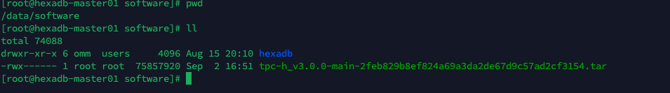
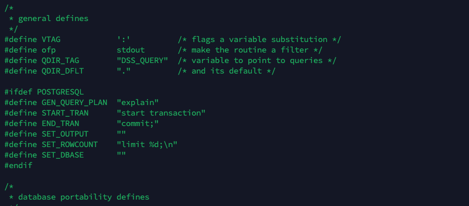
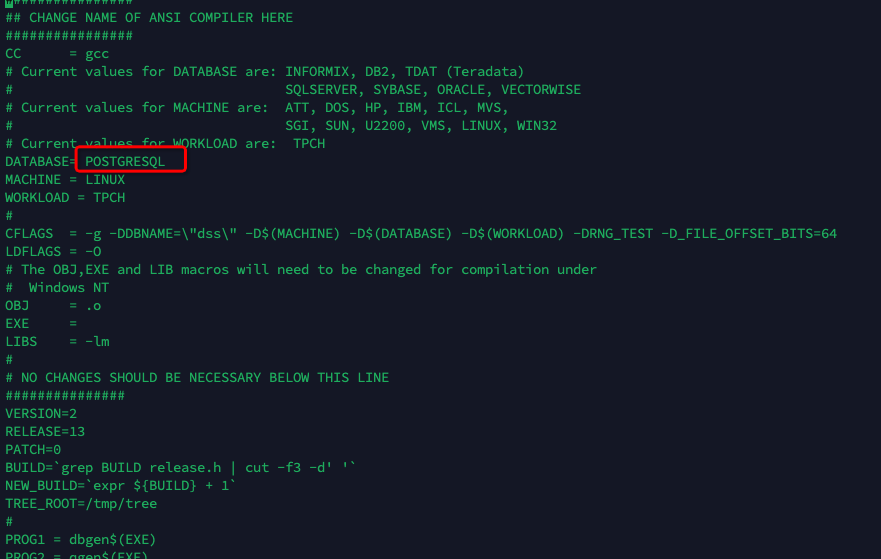

# TPC-H 最佳实践

## 一、TPC-H 概述

TPC-H（Transaction Processing Performance Council Benchmark H）是一个由美国交易处理效能委员会（TPC）组织制定的测试基准，专门用于模拟和评估决策支持类应用的性能。
TPC-H 是一个决策支持基准，通过模拟数据库中与业务相关的复杂查询和并行的数据修改操作，来考察数据库的综合处理能力。主要目的是评价特定查询的决策支持能力，强调服务器在数据挖掘、分析处理方面的能力。

### 1.2 测试内容

TPC-H 基准模型涉及 22 条复杂的 SELECT 查询流语句和 2 条带有 INSERT 和 DELETE 程序段的更新流语句。这些查询旨在回答现实世界中的商业问题，模拟生成的即席查询比大多数 OLTP（在线事务处理）事务复杂得多。

### 1.3 测试工具

git 仓库地址：
https://codeup.aliyun.com/634e0c6267fa83af64bd0235/hexadb/db-test/tpc-h_v3.0.0/tree/main/TPC-H_Tools_v3.0.0

下载地址：
https://codeup.aliyun.com/634e0c6267fa83af64bd0235/hexadb/db-test/tpc-h_v3.0.0/repository/archive.tar.gz?spm=a2cl9.codeup_devops2020_goldlog_projectFiles.0.0.7ff660a6xf34op&ref=main

## 二、测试步骤

1. **下载与编译**：从 TPC 官网下载测试工具和相关文档，并进行编译。
2. 数据库参数调整
3. **创建数据库与表**，**导入数据**：根据 TPC-H 模型创建数据库和相应的表，并设置主键等约束。使用提供的工具或脚本将测试数据导入到数据库中。
4. **执行测试**：按照 TPC-H 规定的测试流程执行查询和更新操作，并收集测试结果。
5. **报告生成**：根据测试结果生成测试报告，包括测试数据库的大小、TPC-H 性能指标（QphH@Size）等信息

## 三、下载安装

> 测试工具上传到海纳 DN 节点服务器

### 3.1 下载

下载地址： https://codeup.aliyun.com/634e0c6267fa83af64bd0235/hexadb/db-test/tpc-h_v3.0.0/repository/archive.tar.gz?spm=a2cl9.codeup_devops2020_goldlog_projectFiles.0.0.7ff660a6xf34op&ref=main

上传/下载 工具包到服务器 `/data/software/`目录下



### 3.2 解压

```shell
mkdir -p /data/tpc-h/
tar -xvf /data/software/tpc-h_v3.0.0-*.tar -C /data/tpc-h/
mv /data/tpc-h/tpc-h_v3.0.0-* /data/tpc-h/tools
cd /data/tpc-h/
chown -R omm:dbgrp *
```

### 3.3 编译

#### 1. 修改`/data/tpc-h/tools/TPC-H_Tools_v3.0.0/dbgen` 目录下的 tpcd.h 文件

添加数据库定义 postgresql

```c
#ifdef POSTGRESQL
#define GEN_QUERY_PLAN  "explain"
#define START_TRAN      "start transaction"
#define END_TRAN        "commit;"
#define SET_OUTPUT      ""
#define SET_ROWCOUNT    "limit %d;\n"
#define SET_DBASE       ""
#endif
```

修改后示例：



#### 2. 修改 `Makefile` 文件 ，配置数据库类型,修改后示例：



#### 3. 编译

```shell
make -f Makefile
```

> 检查 gcc 是否安装，未安装使用 `yum instal gcc` 安装

# 四、初始化数据

回到工具跟目录 `/data/tpc-h/tools/`

1.  执行 `sh Build.sh` ： 默认生成 500G 数据
    
    可以修改 Build.sh 中的 Scale 配置生成指定的数据量

2.  执行 `sh Load.sh` : 创建数据库及加载数据

    切换到数据库用户 `omm` 下执行  
     `Load.sh` 脚本中的 `scale` 配置要和 Build.sh 保持一致

## 五、数据库参数调整

1. 通用参数调整

```shell
cat <<__CN_END__ > cn_guc.$$
bypass_workload_manager | on
checkpoint_segments     | 128
effective_cache_size    | '1GB'
enable_codegen          | on
enable_orc_cache        | off
enable_stream_operator  | off
enable_wdr_snapshot     | on
instr_unique_sql_count  | 200000
local_syscache_threshold| '16MB'
maintenance_work_mem    | '256MB'
max_active_statements   | -1
max_connections         | 4000
max_coordinators        | 128
max_datanodes           | 256
max_files_per_process   | 1024
max_pool_size           | 8192
max_replication_slots   | 20
max_size_for_xlog_prune | 268435456
max_wal_senders         | 20
most_available_sync     | off
recovery_time_target    | 60
standby_shared_buffers_fraction| 1
tcp_keepalives_count    | 20
tcp_keepalives_idle     | 60
tcp_keepalives_interval | 30
use_workload_manager    | on
vacuum_cost_delay       | 1
vacuum_cost_limit       | 1000
wal_keep_segments       | 128
xloginsert_locks        | 16
work_mem                | '128MB'
__CN_END__


cat <<__DN_END__ > dn_guc.$$
advance_xlog_file_num   | 32
bulk_read_ring_size     | '2GB'
bulk_write_ring_size    | '2GB'
bypass_workload_manager | on
checkpoint_segments     | 128
effective_cache_size    | '20GB'
enable_codegen          | on
enable_orc_cache        | off
enable_stream_operator  | off
enable_wdr_snapshot     | on
instr_unique_sql_count  | 200000
local_syscache_threshold| '16MB'
maintenance_work_mem    | '256MB'
max_active_statements   | -1
max_connections         | 4000
max_coordinators        | 128
max_datanodes           | 256
max_files_per_process   | 1024
max_pool_size           | 8192
max_replication_slots   | 20
max_size_for_xlog_prune | 268435456
max_wal_senders         | 20
most_available_sync     | off
recovery_time_target    | 60
standby_shared_buffers_fraction| 1
tcp_keepalives_count    | 20
tcp_keepalives_idle     | 60
tcp_keepalives_interval | 30
use_workload_manager    | on
vacuum_cost_delay       | 1
vacuum_cost_limit       | 1000
wal_keep_segments       | 128
xloginsert_locks        | 16
work_mem                | '128MB'
__DN_END__

rm -f set_guc.$$
awk -F "|" 'BEGIN{O=""}/|/{gsub(/ /, "",$1); gsub(/ /, "",$2); O=O" -c \x22"$1"="$2"\x22"}END{print "gs_guc set -Z coordinator -I all -N all", O}' cn_guc.$$ >> set_guc.$$
awk -F "|" 'BEGIN{O=""}/|/{gsub(/ /, "",$1); gsub(/ /, "",$2); O=O" -c \x22"$1"="$2"\x22"}END{print "gs_guc set -Z datanode    -I all -N all", O}' dn_guc.$$ >> set_guc.$$

rm -f cn_guc.$$ dn_guc.$$

sh set_guc.$$
rm set_guc.$$
```

服务器上编辑生成 `general_guc.sh` 使用 数据库用户`omm`执行 3. OLAP 参数调整
脚本

```shell
# sort GUC name in alphabetic order!!!

gs_guc set -Z coordinator -I all -N all \
    -c "enable_dynamic_workload=on" \
    -c "enable_stream_operator=on" \
    -c "enable_thread_pool=off" \
    -c "cstore_buffers='1GB'" \
    -c "query_dop=0" \
    -c "max_connections=100" \
    -c "shared_buffers='256MB'" \
    -c "track_stmt_retention_time='18000,604800'"

gs_guc set -Z datanode -I all -N all \
    -c "enable_dynamic_workload=on" \
    -c "enable_stream_operator=on" \
    -c "enable_thread_pool=off" \
    -c "comm_max_stream=4096" \
    -c "cstore_buffers='4GB'" \
    -c "query_dop=0" \
    -c "max_connections=100" \
    -c "shared_buffers='256MB'"

```

服务器上编辑生成 `olap_guc.sh` 使用 数据库用户`omm`执行

## 六、执行测试

回到工具跟目录 `/data/tpc-h/tools/`

切换到数据库用户`omm` 执行 脚本 `sh Run.sh`

## 测试报告

参考 TPC-H 测试报告编写
